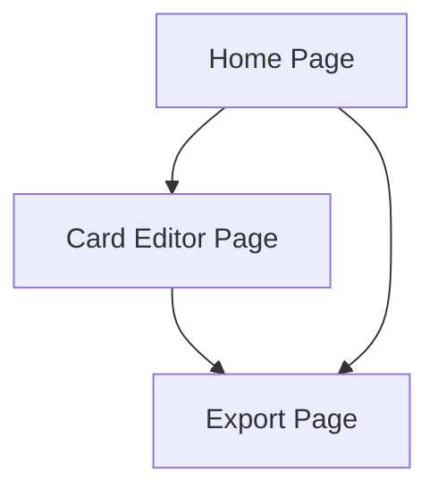

# Text to Anki Card Converter - Product Requirements Document

## 1. Product Overview
A web application that allows users to input text and automatically generate Anki flashcards for efficient learning and memorization.
- Solves the problem of manually creating flashcards by automating the process of converting text content into structured question-answer pairs.
- Target users include students, language learners, and professionals who need to memorize information efficiently.

## 2. Core Features

### 2.1 Feature Module
Our AI-powered text-to-Anki converter consists of the following main pages:
1. **Home page**: text input area, AI summarization, content rearrangement, card generation controls, preview section, LLM provider selection.
2. **Card editor page**: individual card editing, AI-enhanced editing, smart suggestions, batch operations, card management.
3. **Export page**: format selection, download options, sharing features.
4. **Settings page**: API configuration, LLM provider settings, custom base URL support.

### 2.2 Page Details

| Page Name | Module Name | Feature description |
|-----------|-------------|---------------------|
| Home page | Text Input Area | Accept multi-line text input with formatting options and character count display |
| Home page | AI Summarization | Automatically summarize long content into key points. Extract main concepts and important information for card creation |
| Home page | Content Rearrangement | AI-powered content reorganization to optimize learning flow. Suggest logical grouping and sequencing of information |
| Home page | Generation Controls | Configure card generation settings including card type, difficulty level, and auto-split options |
| Home page | Preview Section | Display generated cards in real-time with front/back preview and navigation controls |
| Home page | LLM Provider Selection | Choose from OpenAI, Claude, Gemini, or custom third-party APIs. Switch between different AI models for optimal results |
| Card Editor | Individual Editor | Edit card front/back content, add tags, set difficulty, and include media attachments |
| Card Editor | AI-Enhanced Editing | Edit individual cards with AI suggestions for better question formulation and answer clarity |
| Card Editor | Smart Suggestions | AI-powered recommendations for improving card quality, difficulty adjustment, and content optimization |
| Card Editor | Batch Operations | Select multiple cards for bulk editing, deletion, or formatting changes |
| Card Editor | Card Management | Organize cards into decks, reorder cards, and apply templates |
| Export page | Format Selection | Choose export format (Anki .apkg, CSV, JSON) with format-specific options |
| Export page | Download Options | Generate downloadable files with custom naming and compression settings |
| Export page | Sharing Features | Generate shareable links and direct import to Anki applications |
| Settings page | API Configuration | Configure API keys for OpenAI, Claude, Gemini. Set custom base URLs for third-party LLM providers |
| Settings page | Model Selection | Choose specific models (GPT-4, Claude-3, Gemini Pro). Configure model parameters like temperature and max tokens |

## 3. Core Process
The main user workflow follows these AI-enhanced steps:
1. **Text Input**: User pastes or types content into the input area
2. **AI Processing**: System automatically summarizes and rearranges content for optimal learning
3. **Format Selection**: Choose desired card generation format with AI recommendations
4. **Smart Card Generation**: AI creates optimized flashcards with intelligent content extraction
5. **AI-Enhanced Preview**: Review generated cards with smart suggestions for improvement
6. **Intelligent Editing**: Make adjustments with AI-powered editing assistance
7. **Export**: Download cards in Anki-compatible format or share with others

Users start by entering their text content in the input area on the home page. The AI system automatically processes, summarizes, and rearranges this text for optimal learning flow, then generates flashcards based on the configured settings. Users can preview the generated cards with AI-powered suggestions and make adjustments. They then proceed to the card editor to fine-tune individual cards with AI assistance or perform batch operations. Finally, users export their cards in their preferred format from the export page.

## 4. Technical Implementation
### 4.1 AI Integration
The AI functionality is implemented through multiple LLM API providers:
- **OpenAI**: GPT-3.5, GPT-4, GPT-4 Turbo models for text processing and card generation
- **Claude**: Anthropic's Claude-3 models for content summarization and rearrangement
- **Gemini**: Google's Gemini Pro for intelligent text analysis and optimization
- **Third-party APIs**: Support for custom base URLs and compatible API endpoints
- **API Management**: Secure key storage, rate limiting, and fallback mechanisms
- **Model Selection**: User-configurable model parameters (temperature, max tokens, etc.)

## 5. User Interface Design
### 5.1 Design Style
- **Primary Colors**: Blue (#2563eb) and white (#ffffff) for a clean, professional look
- **Secondary Colors**: Gray (#6b7280), light blue (#dbeafe), and purple (#8b5cf6) for AI features
- **Button Style**: Rounded corners with subtle shadows and hover effects, special gradient styling for AI-powered buttons
- **Typography**: Inter or system fonts with 16px base size for readability
- **Layout**: Clean card-based design with generous white space and prominent AI feature highlights
- **Icons**: Outline style icons with consistent stroke width, special AI/brain icons for intelligent features
- **AI Elements**: Subtle animations and glowing effects to indicate AI processing and suggestions

### 5.2 Page Design Overview

| Page Name | Module Name | UI Elements |
|-----------|-------------|-------------|
| Home page | Text Input Area | Large textarea with border radius 8px, placeholder text, and character counter in bottom right |
| Home page | Generation Controls | Horizontal button group with primary blue buttons, dropdown menus with white background |
| Home page | Preview Section | Card-style containers with flip animation, navigation arrows, and progress indicator |
| Card Editor | Individual Editor | Split-pane layout with form inputs, tag chips in blue, and save/cancel buttons |
| Card Editor | Batch Operations | Checkbox selection with blue checkmarks, action toolbar with icon buttons |
| Export page | Format Selection | Radio button groups with descriptive labels and format icons |
| Export page | Download Options | Primary download button in blue, secondary options in gray outline style |

### 5.3 Responsiveness
The application is designed mobile-first with responsive breakpoints at 768px and 1024px, optimizing for both desktop and mobile usage with touch-friendly interactions.